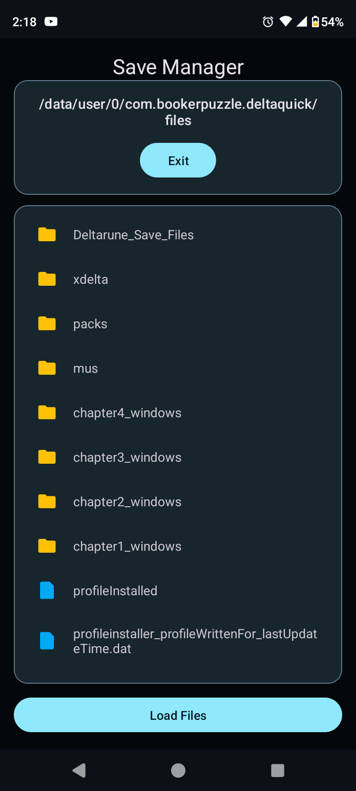
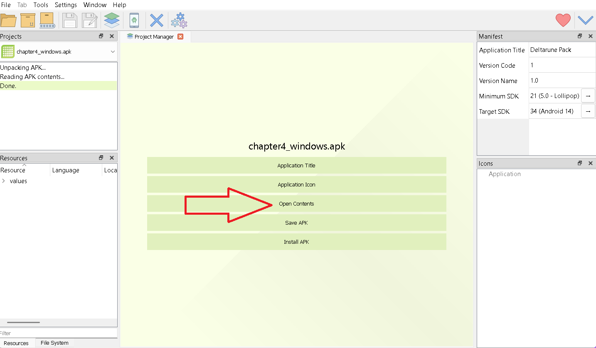
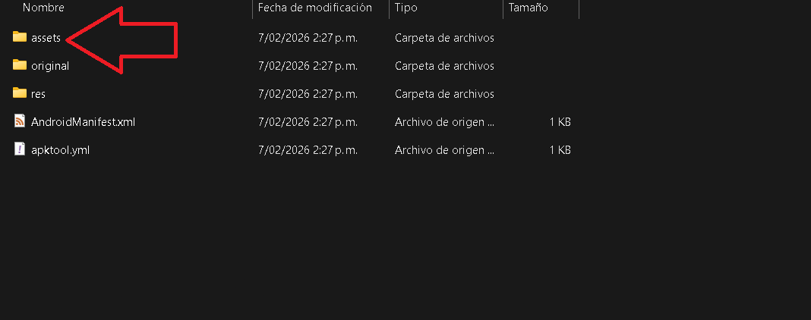
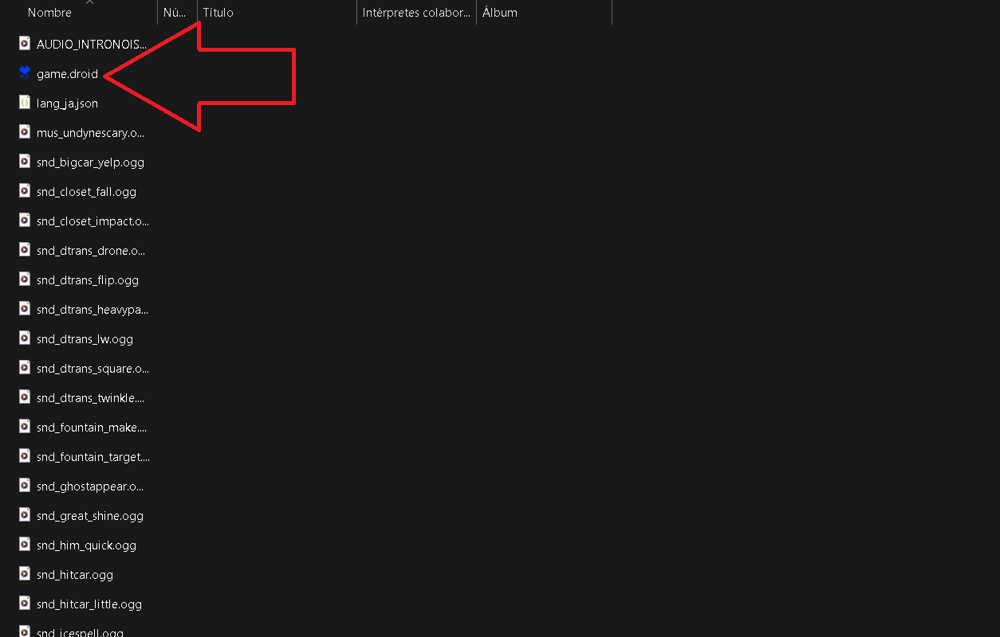

# Deltaquick Porting Tools

This guide contains the steps and tools necessary to port modifications to **Deltaquick** (Deltarune Android Launcher).

> [!CAUTION]
> **IMPORTANT:** This document is intended for **advanced users** who are familiar with modifying Deltarune/Undertale.

---

## Prerequisites

To proceed, you will need the following tools:

* [UndertaleModTool](https://github.com/UnderminersTeam/UndertaleModTool)
* [APK Editor Studio](https://qwertycube.com/apk-editor-studio/)
* [Deltaquick](https://play.google.com/store/apps/details?id=com.bookerpuzzle.deltaquick&pcampaignid=web_share)
* [UndertaleModTool Scripts](https://github.com/BookerRues9/Deltaquick-porting-tools/tree/main/scripts)

**Requirement:** Ensure Deltaquick is configured and updated to **version 1.1.9** or higher.

---

## File System Overview

To adapt modifications, you must understand how Deltaquick manages its internal storage. Deltaquick uses its own **Save Manager** to extract, delete, and copy files.

### Directory Structure:

* `/data/user/0/com.bookerdev.deltaquick/files/deltarune_save_files/`  
    → Save data and game progress.
* `/data/user/0/com.bookerdev.deltaquick/files/xdelta/`  
    → XDelta patches for game fixes.
* `/files/packs/`  
    → Contains APK files with the `game.droid` for each chapter (visible after configuration).
* `/files/mus/`  
    → Global directory for music files.
* `/files/chapter1_windows/` to `/chapter4_windows/`  
    → Assets required for each specific chapter.



---

## Replacing `game.droid` Files

Each chapter is stored in a specific APK pack. Follow these steps to modify them:

### 1. Identify the Pack
* `selector.apk` → **Chapter Select**
* `chapter1_windows.apk` → **Chapter 1**
* `chapter2_windows.apk` → **Chapter 2**
* `chapter3_windows.apk` → **Chapter 3**
* `chapter4_windows.apk` → **Chapter 4**
**NOTE:** These files are always generated after patching data.win with xdelta files; the app generates them automatically.

### 2. Modification Process

1. **Extraction:** Open **Save Manager**, long-press the desired APK, and select **Extract**. Transfer the APK to your PC.
2. **Decompilation:** Open the APK with **APK Editor Studio**.
3. **Open Contents:** Click the **Open Contents** button to access the internal files.
   <br>
4. **Replacement:** Navigate to the `assets` folder.
   <br>
   <br>Inside the folder, replace the existing `game.droid` with your modified version.
   <br>
5. **Rebuilding:** Click **Save APK** in APK Editor Studio.
6. **Deployment:** Transfer the modified APK back to your phone. In the Save Manager's `packs` folder, press **Load Files** and select your modified APK.
   * *Note: The filename must remain identical to the original (e.g., chapter4_windows.apk).*

## Technical Adaptation (UndertaleModTool)

These modifications are mandatory for the game to function correctly on Android.

### 1. Script Injection
Open your `game.droid` and run the following scripts via `Scripts -> Run Other Script`:
* `tools.csx`: Adds essential tools.
* `FIX_AUDIO.csx`: Fixes SFX (must be applied to all files EXCEPT Chapter Select).

### 2. External Directory Setup
In **Chapters 1 through 4**, navigate to `obj_initializer2_Create_0` and add:

```gml
if (os_type == os_android)
    global.savepath = init_external_dir();
else
    global.savepath = game_save_id;
```
3. Sound Initialization Fix
In Chapters 1 through 4, locate the script gml_GlobalScript_snd_init and replace it with:
```gml
function snd_init(arg0)
{
    var dir = "mus/";
    
    if (global.launcher)
    {
        if (os_type == os_android)
            dir = global.savepath + "mus/";
        else
            dir = working_directory + "../mus/";
    }
    
    if (os_type == os_android)
        dir = global.savepath + "mus/";
    else
        dir = working_directory + "../mus/";
    
    initsongvar = dir + arg0;
    _mystream = audio_create_stream(initsongvar);
    _astream = instance_create(0, 0, obj_astream);
    _astream.mystream = _mystream;
    return _mystream;
}
```
4. Language Loading Fix
In all chapters, find scr_84_load_json and replace the existing path logic with:

```gml
var name = "lang_" + global.lang + ".json";
var orig_filename = "lang/" + name;
var new_filename = "lang-new/" + name;
var filename = orig_filename;
var type = "orig";
var orig_map = scr_84_load_map_json(orig_filename);
```
5. Black Screen Fix (Startup)
In obj_initializer2_Step_0, replace the audio group check:
Before:
```gml
if (audio_group_is_loaded(1))
```
After:
```gml
if (os_type == os_android || os_type == os_windows)
```
Chapter Switching (game_change)
1. Chapter Select Configuration
In CHAPTER_SELECT (obj_CHAPTER_SELECT_Create_0), add the Android case:
```gml
case os_macosx:
    game_change("chapter" + chapstring + "_mac", parameters);
    break;

case os_android:
    game_change_android("chapter" + chapstring + "_windows");
    break;
```
2. Universal Chapter Switch Script
Replace the entire content of gml_GlobalScript_scr_chapterswitch with:
```gml
function scr_chapterswitch(arg0 = 0)
{
    var parameters = get_chapter_switch_parameters();
    
    if (arg0 == 0)
    {
        if (scr_is_switch_os())
        {
            game_change("rom:/", parameters);
        }
        else
        {
            switch (os_type)
            {
                case os_windows:
                    game_change("/../", "-game data.win" + parameters);
                    break;
                case os_ps4:
                    game_change("", "-game /app0/games/game.win" + parameters);
                    break;
                case os_ps5:
                    game_change("", "-game /app0/games/game.win" + parameters);
                    break;
                case os_macosx:
                    game_change("..", parameters);
                    break;
                case os_android:
                    game_change_android("");
                    break;
            }
        }
    }
    else
    {
        var chapstring = string(arg0);
        
        if (scr_is_switch_os())
        {
            game_change("rom:/chapter" + chapstring + "_switch/", parameters);
        }
        else
        {
            switch (os_type)
            {
                case os_windows:
                    game_change("/../chapter" + chapstring + "_windows", "-game data.win" + parameters);
                    break;
                case os_ps4:
                    game_change("", "-game /app0/games/chapter" + chapstring + "_ps4/game.win" + parameters);
                    break;
                case os_ps5:
                    game_change("", "-game /app0/games/chapter" + chapstring + "_ps5/game.win" + parameters);
                    break;
                case os_macosx:
                    game_change("../chapter" + chapstring + "_mac", parameters);
                    break;
                case os_android:
                    game_change_android("chapter" + chapstring + "_windows");
                    break;
            }
        }
    }
}
```
Chapter 3 Video Fix
To fix the video loading for the Tenna sequence, navigate to obj_ch3_couch_video_Create_0 and update the call:
```gml
video_open(global.savepath + "chapter3_windows/vid/" + file_name + ".mp4");
```

Troubleshooting & Additional Info
- Touch Controls: Built-in. Swipe right during gameplay to open the configuration menu.
* **Crashes:** For a detailed guide on solving common crashes, visit: [Troubleshooting Guide](./crash%20fixes/README.md)
### Credits
- Toby Fox: Deltarune
- Angela Puzzle: Deltarune Android Port (2021-2026)
- ateskit: Deltarune Android (2025-2026)
- Booker: Deltaquick Android + Porting tools
- mattiw: Base touch controls
- jockeholm: Undertale Android port 2018
- grossley: UndertaleModTool
- Google & YoYo Games: Android Studio / Game Maker Studio
