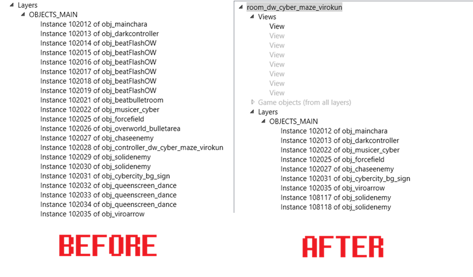

# DeltaQuick Crash Fixes

This guide addresses known issues and provides technical solutions for crashes encountered while playing DeltaQuick or testing your adapted modifications.

> [!NOTE]
> All modifications described here must be performed using **UndertaleModTool**. This guide will be updated as new versions of Deltarune are released.

---

## Chapter 2: Room Crash Fix

**Location:** `room_dw_cyber_maze_virokun`

To resolve crashes in this specific room, you must modify the object layers to ensure proper initialization on mobile hardware.

1. Open the room in UndertaleModTool.
2. Navigate to **Layers** -> **OBJECTS_MAIN**.
3. Adjust the settings as shown in the comparison below:

<p align="center">
  
</p>

---

## Chapter 3: Knight Split Crash

This crash occurs during the Knight encounter due to surface handling issues on Android.

### 1. Sprite Preparation
1. Download the fixed sprite package: [spr_custom_box_nocrash.zip](LINK_HERE)
2. Extract the contents into a folder named `sprites`.
3. In UndertaleModTool (with Chapter 3 `game.droid` open), go to:
   `Scripts > Resource Importers > importGraphics.csx`
4. Select your `sprites` folder to import the new assets.

### 2. Code Modification
You must update three specific objects to bypass the surface creation crash.

**Object:** `gml_Object_obj_knight_split_growtangle_Other_11`  
**Replace:**
```gml
spr_custom_box = sprite_create_from_surface(other.source_surf, 0, 0, 170, 170, true, false, 85, 85);
```
**With:**
```gml
spr_custom_box = spr_custom_box_nocrash;
```
Object: gml_Object_obj_battle_cleanup_Alarm_0
**Replace:**
```gml
if (sprite_exists(custom_box_sprite))
```
**With:**
```gml
if (sprite_exists(custom_box_sprite) && custom_box_sprite != spr_custom_box_nocrash)
```
Object: gml_Object_obj_battle_cleanup_Step_0
**Replace:**
```gml
if (sprite_exists(custom_box_sprite))
```
**With:**
```gml
if (sprite_exists(custom_box_sprite) && custom_box_sprite != spr_custom_box_nocrash)
```
Chapter 3: Performance Fix (MALI G57 MC1 GPU)
Devices using Mali GPUs (like the G57 MC1) may experience severe FPS drops when returning to the Dark World. This is caused by inefficient smoke rendering on mobile drivers.
Object: gml_Object_obj_dw_blacksmoke_Draw_0
**Replace the entire code block with the optimized version below:**
```gml
if (os_type == os_windows)
{
    if (type == 0)
    {
        timer++;
        var smokeamount = 0;
        
        if (i_ex(obj_mainchara))
        {
            var _room_width = room_width;
            var _offset = 400;
            
            if (room == room_dw_snow_zone)
            {
                _room_width = 7600;
                _offset = 3000;
            }
            
            smokeamount = clamp((obj_mainchara.x - _offset) / _room_width, 0, 1);
        }
        
        depth = 5000;
        draw_sprite_tiled_ext(spr_bg_fountain1, 0, timer * 1.6, timer * 1.8, 2, 2, c_dkgray, smokeamount);
        draw_sprite_tiled_ext(spr_bg_fountain1, 0, timer * 1.1, timer, 2, 2, c_black, smokeamount);
        draw_sprite_tiled_ext(spr_bg_fountain1, 0, timer / 2, timer / 1.5, 2, 2, c_black, smokeamount);
    }
    
    if (type == 1 || type == 2)
    {
        if (init == 0)
        {
            init = 1;
            overlay = scr_marker(-10, -10, spr_whitepx_10);
            overlay.image_xscale = (room_width / 10) + 2;
            overlay.image_yscale = (room_height / 10) + 2;
            overlay.image_blend = merge_color(c_black, c_navy, 0.5);
            overlay.image_alpha = 0.6;
            overlay.depth = 1000;
            
            if (room == room_town_shelter)
            {
                var left_cover = scr_marker(-10, -10, spr_whitepx_10);
                
                with (left_cover)
                {
                    image_blend = c_black;
                    image_yscale = (room_height / 10) + 2;
                    depth = 1100;
                }
                
                var right_cover = scr_marker(room_width, -10, spr_whitepx_10);
                
                with (right_cover)
                {
                    image_blend = c_black;
                    image_yscale = (room_height / 10) + 2;
                    depth = 1100;
                }
            }
        }
        
        depth = 400000;
        var ballregionl = 153;
        var ballregionr = 182;
        var bally = 150;
        
        if (type == 1)
        {
            draw_set_color(c_black);
            ossafe_fill_rectangle(153, 142, 182, 189, false);
        }
        
        if (type == 2)
        {
            ballregionl = 125;
            ballregionr = 200;
            bally = 1120;
        }
        
        timer++;
        
        if (timer >= 2)
        {
            timer = 0;
            var ball = scr_marker(random_range(ballregionl, ballregionr), bally, spr_ball);
            ball.image_blend = c_black;
            scr_doom(ball, 60);
            var randomscale = 0.3 + random(0.5);
            scr_lerpvar_instance(ball, "image_xscale", 0, randomscale, 10, -1, "out");
            scr_lerpvar_instance(ball, "image_yscale", 0, randomscale, 10, -1, "out");
            scr_lerpvar_instance(ball, "image_alpha", 8, 0, 60);
            ball.image_xscale = 0;
            ball.image_yscale = 0;
            ball.depth = 300000;
            
            if (type == 2)
                ball.depth = 5000;
            
            ball.gravity = -0.2;
            ball.friction = 0.1;
            ball.hspeed = random_range(-3, 3);
        }
    }
}

if (os_type == os_android)
{
    if (type == 0)
    {
        timer++;
        var smokeamount = 0;
        
        if (i_ex(obj_mainchara))
        {
            var rw = room_width;
            var off = 400;
            
            if (room == room_dw_snow_zone)
            {
                rw = 7600;
                off = 3000;
            }
            
            smokeamount = (obj_mainchara.x - off) / rw;
            
            if (smokeamount < 0)
                smokeamount = 0;
            else if (smokeamount > 1)
                smokeamount = 1;
        }
        
        depth = 5000;
        
        if (smokeamount > 0.01)
        {
            var t = timer;
            draw_sprite_tiled_ext(spr_bg_fountain1, 0, t * 1.6, t * 1.8, 2, 2, c_dkgray, smokeamount);
            draw_sprite_tiled_ext(spr_bg_fountain1, 0, t * 1.1, t, 2, 2, c_black, smokeamount);
            draw_sprite_tiled_ext(spr_bg_fountain1, 0, t * 0.5, t * 0.6666667, 2, 2, c_black, smokeamount);
        }
    }
    
    if (type == 1 || type == 2)
    {
        if (init == 0)
        {
            init = 1;
            overlay = scr_marker(-10, -10, spr_whitepx_10);
            overlay.image_xscale = (room_width * 0.1) + 2;
            overlay.image_yscale = (room_height * 0.1) + 2;
            overlay.image_blend = merge_color(c_black, c_navy, 0.5);
            overlay.image_alpha = 0.6;
            overlay.depth = 1000;
            
            if (room == room_town_shelter)
            {
                var hscale = (room_height * 0.1) + 2;
                var left_cover = scr_marker(-10, -10, spr_whitepx_10);
                
                with (left_cover)
                {
                    image_blend = c_black;
                    image_yscale = hscale;
                    depth = 1100;
                }
                
                var right_cover = scr_marker(room_width, -10, spr_whitepx_10);
                
                with (right_cover)
                {
                    image_blend = c_black;
                    image_yscale = hscale;
                    depth = 1100;
                }
            }
        }
        
        depth = 400000;
        var ball_l = 153;
        var ball_r = 182;
        var ball_y = 150;
        
        if (type == 1)
        {
            draw_set_color(c_black);
            ossafe_fill_rectangle(153, 142, 182, 189, false);
        }
        else
        {
            ball_l = 125;
            ball_r = 200;
            ball_y = 1120;
        }
        
        if (++timer >= 2)
        {
            timer = 0;
            var bx = ball_l + random(ball_r - ball_l);
            var ball = scr_marker(bx, ball_y, spr_ball);
            ball.image_blend = c_black;
            scr_doom(ball, 60);
            var randomscale = 0.3 + random(0.5);
            scr_lerpvar_instance(ball, "image_xscale", 0, randomscale, 10, -1, "out");
            scr_lerpvar_instance(ball, "image_yscale", 0, randomscale, 10, -1, "out");
            scr_lerpvar_instance(ball, "image_alpha", 8, 0, 60);
            ball.image_xscale = 0;
            ball.image_yscale = 0;
            ball.depth = (type == 2) ? 5000 : 300000;
            ball.gravity = -0.2;
            ball.friction = 0.1;
            ball.hspeed = random(6) - 3;
        }
    }
}
```
Credits
Special thanks to the developers who identified and resolved these critical crashes:

- Booker

- ateskit
